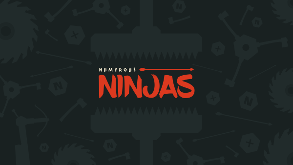
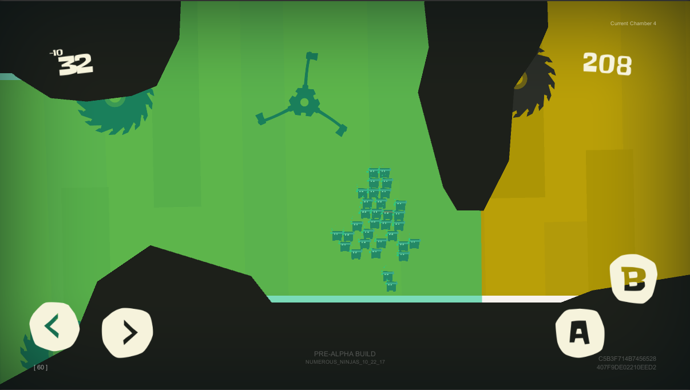
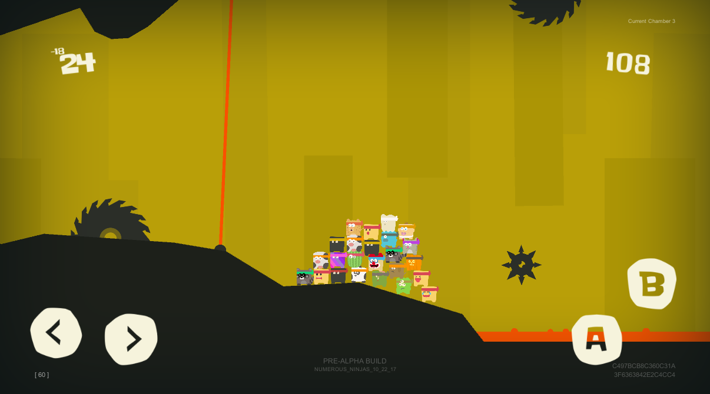

Numerous Ninjas
==========

**Numerous Ninjas** (*codename: Sycophant*) is a beta stage, endless sidescrolling 2D mobile game written by Adam Anderson and David Pokora, using the Unity Engine.

Summary
-----
Customize and play as a school of ninjas with the ability to rotate and walk along any axis you desire, overcoming obstacles through as many chambers as possible. Avoid hot lava, machines/objects that may crush you, weapons that fire projectiles at you, lasers which are activated by your orientation, among various other obstacles. Beware of slower movement in bodies of water, while taking advantage of their lowered gravity benefits and ability to swim upward.  Collect powerups to help you progress through chambers or revive ninjas, but watch out for powerups which may impede your ability to progress easily.

Requirements
-----
+ Unity Engine (may require version 2017.3.0b5 or newer)
+ Microsoft Visual Studio is a plus, but not required.

Controls
-----
**Mobile:**
(Using on-screen controls)
+ Left = Move Left
+ Right = Move Right
+ A = Jump/Swim Upward
+ B = Rotate (90&deg; in facing direction)

**PC (Xbox Controller)**:
+ Left Thumbstick = Move Left/Right
+ A = Jump/Swim Upward
+ B = Rotate (90&deg; in facing direction)

**PC (Keyboard)**:
+ A = Move Left
+ D = Move Right
+ Space = Jump/Swim Upward
+ Shift = Rotate (90&deg; in facing direction)

**Note:** *Playing on PC requires mouse click/holding to spawn ninjas initially or navigate menus in substitute of touch-based clicks.*

Unfinished (TODO)
-----
Though there may be a few more minor things to add, this list covers the notable TODOs, easy as they may be to complete:
+ Create more chambers for increased diverse gameplay.
+ Create a tutorial for new players to introduce obstacles and controls.
+ Create sounds for all obstacles/events which lack them.
+ Display high scores.
+ Update camera tracking to better center the ninja group.
+ Biped movement down a slide may cause an issue in grounding state which becomes visible as a stutter and may impede an immediate jump invocation.

Authors
------
**Adam Anderson**:
[Github](https://github.com/EchoArray)
[Unity Connect](https://connect.unity.com/u/5824e52132b30600209ac207)

**David Pokora**:
[Github](https://github.com/Xenomega)

Contributors
-----
**Hellen TsimOgiannh**: A large portion of ninja character artwork.
[Unity Connect](https://connect.unity.com/u/58e4d3df32b306001c7a812c)

Copyright and License
----
Copyright 2017 Adam Anderson, David Pokora, and Hellen TsimOgiannh
Released under the MIT License, see [here](./LICENSE)